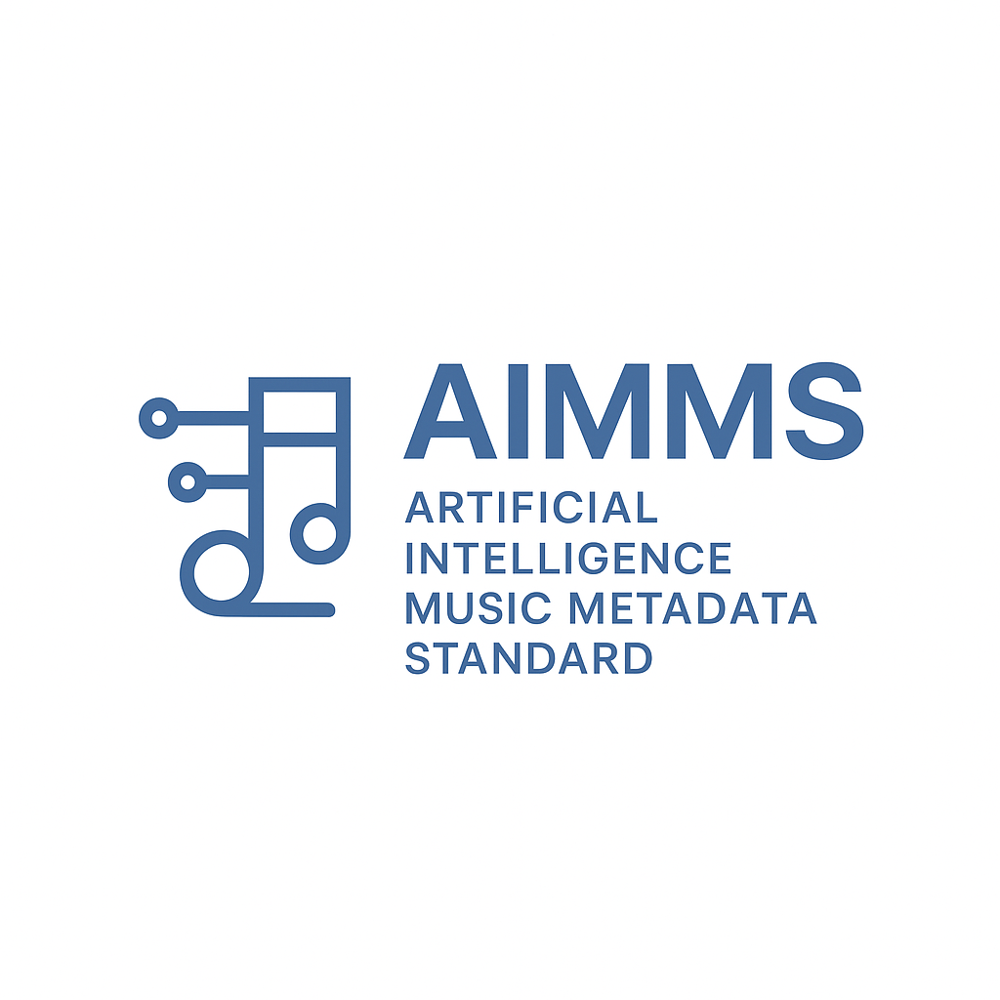

<p align="center">
  
</p>

# 🎵 AIMMS — Artificial Intelligence Music Metadata Standard
**Version 1.0 — November 2025**  
**Founder:** Pasha Shtarskiy  
🌐 [github.com/pashashtarskiy/AIMMS](https://github.com/pashashtarskiy/AIMMS)

---

### 🧠 Mission
AIMMS is an open, transparent metadata standard for AI-assisted music.  
Its goal is to create ethical, technical, and legal clarity between:  
- human artists,  
- AI tools,  
- listeners, and  
- digital distribution platforms.

---

### 📄 Documents
| Document | Description |
|-----------|-------------|
| [AIMMS Policy Brief (PDF)](docs/AIMMS_v1.0_Whitepaper.pdf) | Overview of ethical and industry implications. |
| [AINMS Technical Standard (PDF)](docs/AIMMS_v1.0_Technical_Standard.pdf) | Draft of the proposed metadata schema and implementation guide. |

---

### 🧩 Schema Preview
```json
{
  "track_title": "Seven-Six",
  "creator": "Pasha Shtarskiy",
  "ai_contribution": {
    "type": "voice_clone",
    "provider": "ElevenLabs",
    "consent_proof": "URL-to-signed-declaration"
  },
  "human_contribution": ["lyrics", "melody", "arrangement"],
  "tools_used": ["Ableton Live", "Suno", "ElevenLabs"],
  "license": "CC-BY 4.0"
}
